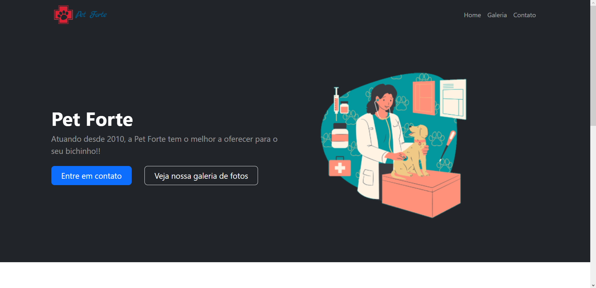
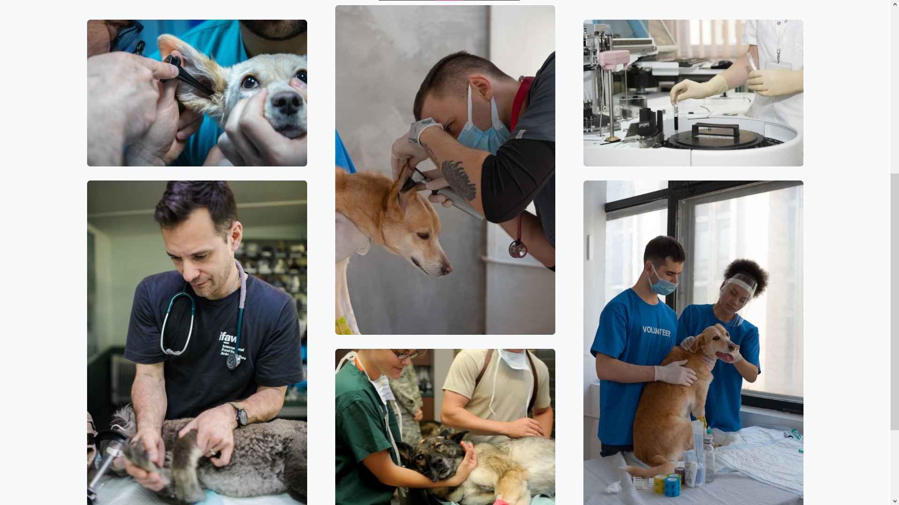
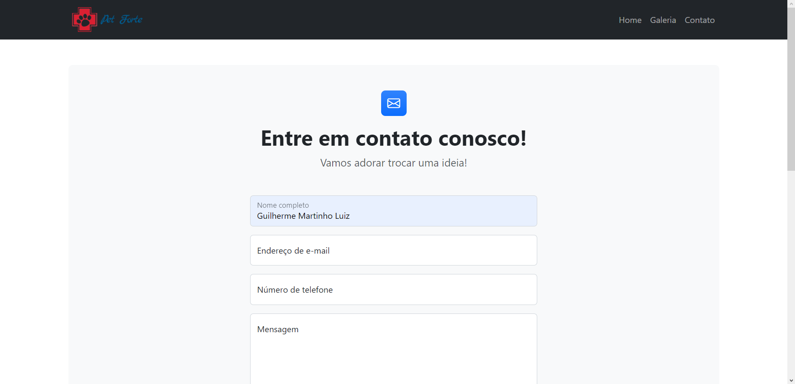

# Pet Forte
 
Desenvolvi essa landing page para uma avaliação da matéria de **Marcação e Layout para Web** no curso de [Sistemas para Internet](https://www.sbv.ifsp.edu.br/index.php/component/content/article/64-ensino/cursos/172-tecnologia-em-sistemas-para-internet) que estou cursando no [Instituto Federal de Educação, Ciência e Tecnologia de São Paulo](https://www.sbv.ifsp.edu.br). Sendo a proposta a seguinte:

> Criar um site completo contendo:
> 
> - Uma página home contendo as informações da empresa
> - Uma página de galeria de imagens (onde serão exibidas as fotos da empresa)
> - Uma página de contato (deve conter um formulário e um mapa de localização)
> 
> Desafio: O site deverá ser feito utilizando Bootstrap
> Tema: Pet Shop

## Screenshots

## Imagens utilizadas

### Home page
- Imagem de [Elf-Moondance](https://tinyurl.com/yc74a254) por [Pixabay](https://tinyurl.com/yeyuhw46)

- Imagem de [Pexels](https://tinyurl.com/mr2h5hdz) por [Pixabay](https://tinyurl.com/4ft6jbmr)

### Galeria

- Imagem de [Mirko Sajkov](https://tinyurl.com/2ebft3hb) por [Pixabay](https://tinyurl.com/5n8vf9h4)

- Imagem de [David Mark](https://tinyurl.com/c7ke49h8) por [Pixabay](https://tinyurl.com/3dhkdmsp)

- Foto de [International Fund for Animal Welfare](https://tinyurl.com/ydn8scsy)

- Foto de [Mikhail Nilov](https://tinyurl.com/3rhxhx98)

- Foto de [Tima Miroshnichenko](https://tinyurl.com/ypkbzsc3)

- Foto de [Mikhail Nilov](https://tinyurl.com/4v4wa6d4)

___

Feito com :heart: por [Gui Luiz](https://github.com/AlarmedEwe)